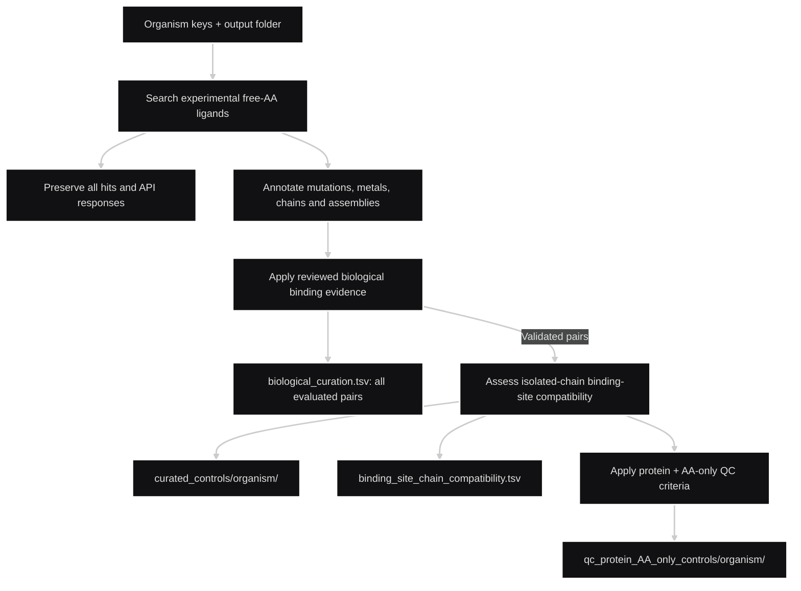

# Build AA–protein QC datasets from scratch

Start with **organism names and an empty output folder**. The workflow downloads experimental structures, biological evidence and coordinates, then generates controls and audits. No existing tables, dataset folder or evidence cache is required.

Only these organisms are supported: **E. coli (`ecoli`), Arabidopsis thaliana (`arabidopsis`), Human (`human`), Mouse (`mouse`) and Saccharomyces cerevisiae (`yeast`)**. Other organisms require changes to the organism filters and reviewed biological decisions.

All 20 canonical amino acids are processed by default. This folder contains scripts and this README only; downloaded data and generated tables go into the output folder.

## Run

Requires Python 3.10+ and internet access. From the parent of this scripts folder, install the dependencies and run, for example, E. coli:

```sh
# install requirements
python -m pip install numpy requests scipy

# run for E.coli (example)
python qc_dataset_workflow/run_workflow.py --out qc_results --organisms ecoli
```

Replace `ecoli` with any supported organism key listed above, or supply several keys separated by spaces. Omitting `--organisms` runs E. coli, Arabidopsis, Human and Mouse; yeast must be selected explicitly.

An output folder must be new or empty. Add `--resume` with the same options to continue an interrupted run. `--aa MET` restricts the AA scope; `--skip-biolip` explicitly omits optional BioLiP corroboration and records that omission. These options are not required for a normal run.

## Workflow

Inputs: one or more organism keys-name (ecoli, `arabidopsis`, `human`, `mouse`, `yeast`) and a new output folder. *All 20 canonical AAs are searched by default. No input tables are needed.*



The search requires `rcsb_nonpolymer_instance_annotation.comp_id = AA` together with `type = HAS_NO_COVALENT_LINKAGE`, using experimental results. An AA appearing in a protein sequence cannot satisfy this ligand selection. All raw hits and API responses are preserved. See the official [Search API](https://search.rcsb.org/) and [Data API](https://data.rcsb.org/) documentation.

Biological evidence comes from UniProt, RCSB publications, available Europe PMC abstracts, BioLiP annotations and KEGG reaction records. **A deposited AA alone never establishes functional binding.** Included Python decisions encode the prior protein-specific evidence review. New or unreviewed pairs are marked for manual review and excluded from positive controls; running the workflow does not replace a biological literature review.

## Scripts

- `run_workflow.py`: Runs the complete workflow.
- `build_aa_pdb_dataset.py`: Searches RCSB and saves all structural hits.
- `split_aa_pdb_by_organism.py`: Separates structural tables by organism.
- `build_strict_aa_controls.py`: Filters mutations, metal coordination and contacting chains.
- `prepare_biological_evidence.py`: Downloads protein, publication and biochemical evidence.
- `biological_decisions.py`: Stores reviewed AA–protein classifications and references.
- `curate_biological_controls.py`: Writes biologically validated controls and curation audits.
- `validate_curated_controls.py`: Checks control schemas, filtering and representative selection.
- `assess_chain_compatibility.py`: Audits ligand contacts and assembly partners.
- `curate_chain_site_compatibility.py`: Classifies compatibility with an isolated protein chain.
- `validate_chain_site_compatibility.py`: Checks compatibility classifications and audit consistency.
- `build_AA_only_qc.py`: Selects protein + AA-only controls; waters allowed.

## Outputs

Inside the chosen output folder:

- `raw/` and the original organism folders: complete search responses, all structural candidates and structural annotations.
- `curated_controls/<organism>/`: the broader biologically validated controls, `biological_curation.tsv` and `binding_site_chain_compatibility.tsv`.
- `qc_protein_AA_only_controls/<organism>/`: the clean QC subset and `qc_composition_audit.tsv`, including reasons for every evaluated candidate. `<organism>` is the selected key listed above.
- Manifests and validation reports: configuration, download issues, file hashes, counts and check results.

Both control sets use the original app filenames:

```text
strict_WT_single_protein_AA_controls.tsv
nonredundant_AA_protein_controls.tsv
```

Their respective 91- and 89-column schemas, column order, tab delimiter, UTF-8 encoding and CRLF formatting are preserved. Evidence and classification fields stay in separate audits. Representatives are selected after filtering, independently for each table, using the original resolution/contact-count ranking. Saved alternatives remain available even when the current representative fails the clean QC rules.

## Clean QC criteria

A candidate must have strong biological evidence and pass all of these checks:

- WT, no noncanonical polymer modifications, a free noncovalent AA, and no ligand metal coordination.
- An unambiguous biological monomer: one protein chain and no additional polymer or glycan partners. Independent crystal copies are allowed.
- Exactly one target AA and **no other non-water compounds** in the applicable biological assemblies. Ions, other ligands and cofactors fail; explicit links to omitted compounds are also checked. Crystallographic waters are allowed.
- A `monomer_compatible` site, a complete occupied AA model and complete modeled heavy atoms in its contacting protein residues.

The broader control files can contain oligomers with self-contained pockets. `monomer_compatible` describes the binding site; the biological-monomer flag describes assembly composition. Neither proves experimentally measured isolated-protein activity.

All candidates are audited. If no structure passes, a valid header-only control file and exclusion report are written; the criteria are not relaxed. Live database updates can change representatives and counts compared with an earlier run.

Validation uses independent TSV, provenance and coordinate checks. **The app, its loader and docking calculations are never run.**
